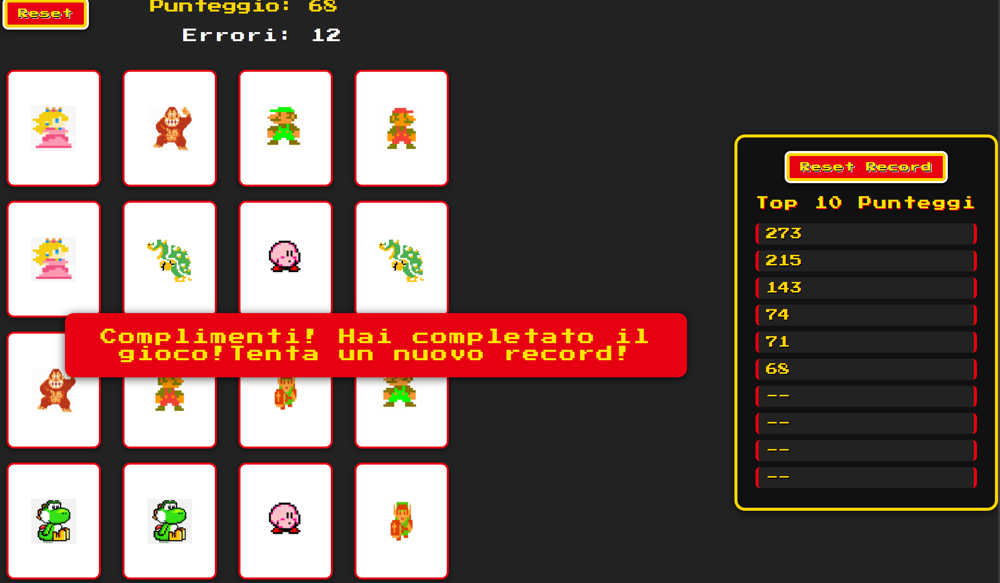

  

  

<h1 align="center">🧠 Memory Game</h1>

 <b>Sfida la tua mente e metti alla prova la tua memoria! Questo gioco Memory è un classico intramontabile reinventato con uno stile moderno e intuitivo. L'obiettivo è semplice: trova tutte le coppie di carte uguali nel minor tempo possibile. Perfetto per tutte le età, stimola la concentrazione, la memoria visiva e la velocità di pensiero.<b> 
 <i>Realizzato con HTML, CSS e JavaScript. 
 Sfida un amico, allena la tua logica e divertiti!</i> 
 <u>Il gioco tiene il conteggio del punteggio e lo salva in una Top Ten permanente!</u>
 <u>Ora puoi attivare o disattivare l'audio tramite una comoda icona!</u>
 <u>Ora all'avvio avrai un'anteprima delle card per 5 secondi!</u>

<!-- Da implementare:
-----Titolo e spiegazione
-----Supababes gioco in real time
-----modalità 3 carte uguali
-----combo cioe' bonus per ogni coppia consecutiva indovinata
-----timer (sommare secondi rimanenti al punteggio)
-----icona disattiva audio
-----easy, medium, hard () -->